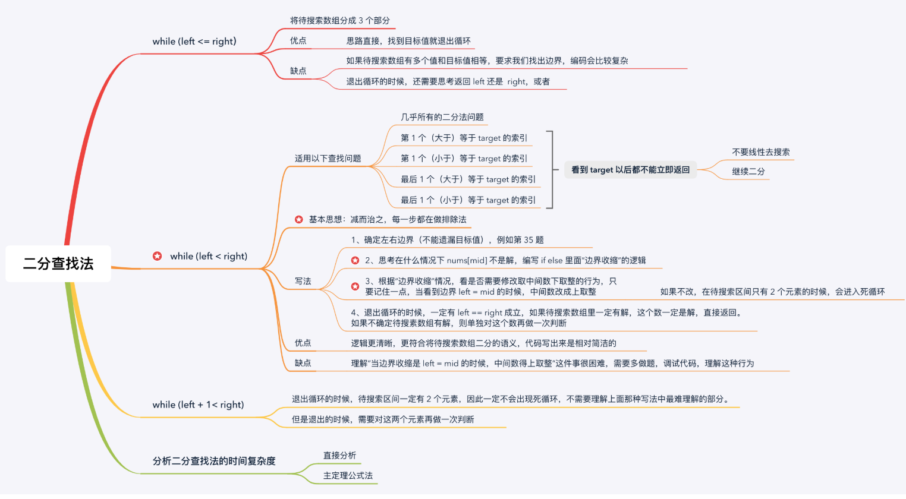

# 用“排除法”写的二分查找算法

- 通常写二分法是奔着目标元素写的
    
    通常教科书上给出的二分查找代码，循环部分给出的条件是 `while (left <= right)` ，表示当 `left == right` 成立的时候，还有一个元素，即索引 `left（right）`位置的元素还没有看到，需要继续查看这个元素的值，看看是不是我们想要的。
    
    这个思路把待查找数组分为了 3 个部分：`mid` 所在位置，`mid` 的左边，`mid` 的右边，根据 `mid` 元素与目标元素的值的大小关系，如果 `nums[mid]` 恰好等于 `target` 直接返回就好了，否则根据不等关系，确定下一轮搜索的区间在哪里。
    
    「力扣」上有些二分题用这种思路做，有的时候往往会顺带思考很多问题，增加了出错率：例如
    
    （1）返回 `left` 还是 `right`；
    
    （2）明明已经看到了等于 `target` 的元素，但是题目要求返回小于等于 `target` 的第 1 个元素的位置，或则要求返回大于等于 `target` 的最后 1 个元素的位置的时候，一不小心会把代码写成线性查找。
    
    这两个问题有时会增加思考问题的负担，一不小心还有可能出错。这一类问题的共同特点是：目标值往往在待查找数组中存在多个，但是题目要求我们返回的是一个边界值。
 
 - 不妨从哪些元素一定不是目标元素考虑
 
    做对这一类问题的思路是“排除法”，在本题解最开始其实已经介绍了，我们的思路是做排除法：具体是根据看到的 `mid` 位置的元素，排除掉不可能存在目标元素的区间，而下一轮在可能存在目标的子区间里查找。
 
    具体做法是：
 
    1、先把循环可以继续的条件写成 `while (left < right)`。
 
    在循环的过程中 `left` 不断右移，`right` 不断左移。从形式上看，退出循环的时候一定有 `left == right` 成立。此时要注意：`left （right）` 这个位置的值可能程序还没有读取到，因此“有可能”需要再对 `left(right)` 这个位置的值是否是目标元素的值做一次判断。
 
    2、写 `if` 和 `else` 语句的时候，思考当 `nums[mid]` 满足什么性质的时候，`mid` 不是解，进而接着判断 `mid` 的左边有没有可能是解，`mid` 的右边有没有可能是解。
 
    说明：
    
    （1）做题的经验告诉我，“思考什么时候不是解”比较好想。生活中其实也是这样，我往往说不大清楚我想要什么，但是我很确定我不想要什么；
 
    之所以先考虑「什么时候不是解」，是因为做了很多题以后发现，这样考虑不容易出错。在 `if` 语句写对的情况下（建议把下一轮搜索的区间写下来，写在注释里，这样边界怎么设置就很清楚了，不容易乱）。else 的情况就不用思考了，肯定是 if 的反面。 然后我们注意一下 mid 是否需要上取整的问题，最后看看是否需要打个补丁判断一下 left 这个位置是不是我们要找的。这个算法就写完了。
 
    （2）此时 `mid` 作为待查找数组的分界，就把它分为两个区间：一个部分可能存在目标元素，一个部分一定不存在目标元素。
 
    根据 `mid` 被分到左边区间还是右边区间，代码写出来只有以下 2 种（重难点）：
 
    边界收缩行为 1： mid 被分到左边。即区间被分成 `[left, mid]` 与 `[mid + 1, right]`，这里用“闭区间”表示区间端点可以取到，下同；
 
    代码写出来是这样的：
    ```$xslt
   if (check(mid)) {
       // 下一轮搜索区间是 [mid + 1, right]，因此把左边界设置到 mid + 1 位置
       left = mid + 1;
   } else {
       // 上面对了以后，不加思考，剩下的区间一定是 [left, mid]，因此左边界向右收缩到 mid 位置
       right = mid;
   }
   ```
    说明：这里的 `check(mid)` 函数通常是一个表达式（例如上面的“参考代码 1”），在一些情况下有可能逻辑比较复杂，建议专门抽取成一个私有方法，以突显主干逻辑。

    边界收缩行为 2： `mid` 被分到右边。即区间被分成 `[left, mid - 1]` 与 `[mid, right]`；

    同上，代码写出来是这样的（由于注释是对称的，这里省略，留给读者填充）：

    ```$xslt
        if (check(mid)) {
            right = mid - 1;
        } else {
            left = mid;
        }
    ```
   
   3、根据“边界收缩行为”修改取中间数的行为（重难点）。
   
   先说一下中间数的取法。一般是这样的：
   `int mid = (left + right) / 2;`
   
   这种写法在绝大多数情况下没问题，但是在 left 和 right 特别大的场景中，left + right 会发生整形溢出，得到一个负数，mid 的值随之也是负数。改进的写法是：
   `int mid = left + (right - left) / 2;`
   
   边界收缩行为 1： mid 被分到左边。即区间被分成 `[left, mid]` 与 `[mid + 1, right]`，此时取中间数的时候下取整。
   
   ```$xslt
    int mid = left + (right - left) / 2;
    if (check(mid)) {
        // 下一轮搜索区间是 [mid + 1, right]
        left = mid + 1;
    } else {
        right = mid;
    }
    ```
   
   边界收缩行为 2： mid 被分到右边。即区间被分成 `[left, mid - 1]` 与 `[mid, right]`，此时取中间数的时候上取整。
   
    ```$xslt
    int mid = left + (right - left + 1) / 2;
    if (check(mid)) {
        // 下一轮搜索区间是 [left, mid - 1]
        right = mid - 1;
    } else {
        left = mid;
    }
    ```
   
   遇到几次死循环，调试正确以后，就能很清楚地记住：
   
   在 `if else` 语句里面只要出现 `left = mid` 的时候，把去中间数行为改成上取整即可。
   
# 使用“排除法”写对二分查找问题的一般步骤



1. 确定搜索区间初始化时候的左右边界，有时需要关注一下边界值。在初始化时，有时把搜索区间设置大一点没有关系，但是如果恰好把边界值排除在外，再怎么搜索都得不到结果。
    
    例如本题，如果一开始把 len 这个位置排除在外进行二分搜索，代码是怎么都通不过评测系统的。

2. 无条件写上 `while (left < right)` ，表示退出循环的条件是 `left == right`，对于返回左右边界就不用思考了，因此此时它们的值相等；

3. 先写下取整的中间数取法，然后从如何把 mid 排除掉的角度思考 `if` 和 `else` 语句应该怎样写。

    （这里建议写两个注释。）

    一般而言，我都会把“什么时候不是目标元素”作为注释写在代码中，提醒自己要判断正确，这一步判断非常关键，直接影响到后面的代码逻辑。
    然后接着思考 `mid` 不是解的情况下，`mid` 的左右两边可能存在解，把下一轮搜索的区间范围作为注释写进代码里，进而在确定下一轮搜索区间边界的收缩行为时，不容易出错。

     `if` 有把握写对的情况下，`else` 就是 `if` 的反面，可以不用思考，直接写出来。

    说明：这种思考方式，就正正好把待搜索区间从逻辑上分成两个区间，一个区间不可能存在目标元素，进而在另一个区间里继续搜索，更符合“二分”的语义。

4. 根据 `if else` 里面写的情况，看看是否需要修改中间数下取整的行为。

    上面已经说了，只有看到 `left = mid` 的时候，才需要调整成为上取整，记住这一点即可，我因为刚开始不理解这种写法，遇到很多次死循环，现在已经牢记在心了。

5. 退出循环的时候，一定有 `left == right` 成立。有些时候可以直接返回 `left` （或者 `right`，由于它们相等，后面都省略括弧）或者与 `left` 相关的数值，有些时候还须要再做一次判断，判断 `left` 与 `right` 是否是我们需要查找的元素，这一步叫“后处理”。

    本题就是这样，因为插入元素的位置，一定在搜索范围里，因此退出循环的时候，不用再做一次判断。


# 与其它二分查找模板的比较
  它们的区别主要在于 `while` ，这是几个模板之间最主要的差别。
  
  1.  `while (left <= right)` 事实上是把待搜索区间“三分”，`if else` 有三个分支，它直接面对目标元素，在目标元素在待搜索数组中有只有 1 个的时候，可能提前结束查找。但是如果目标元素没有在待搜索数组中存在，则不能节约搜索次数；
  
  2. `while (left < right)` 是本题解推荐使用的思考方法，没有写成模板是因为不建议记模板，建议的方法是多做题，掌握“排除法”，更学术的说法是使用“减治法”编写二分查找算法的方法。
  
  优点是：更符合二分语义，不用去思考返回 `left` 还是 `right`，在退出循环的时候，有的时候，根据语境，不正确的数都排除掉，最后剩下的那个数就一定是目标值，不需要再做一次判断。
  
  缺点是：理解当分支逻辑出现 `left = mid` 的时候，要修改取中间数的行为，使其上取整。
  
  3. `while (left + 1 < right)` 这种写法其实很多人都在用，如果你理解了本题解介绍的方法，理解它就很容易了。使用它在退出循环的时候，有 `left + 1 = right` 成立，即 `left` 和 `right`夹成的区间里一定有 2 个元素，此时需要分别判断 `left` 和 `right` 位置的元素是不是目标元素，有时需要注意判断的先后顺序。
  
  优点：不用去理解和处理第 2 点说的那种上取整的行为，因为不会出现死循环。
  缺点：一定需要后处理，在后处理这个问题上增加了思考的负担。另外 `while (left + 1 < right)` 这种写法我个人认为不那么自然。
  
 
  [参考:leetcode（作者liweiwei1419）](https://leetcode-cn.com/problems/search-insert-position/solution/te-bie-hao-yong-de-er-fen-cha-fa-fa-mo-ban-python-/)
 
  

    